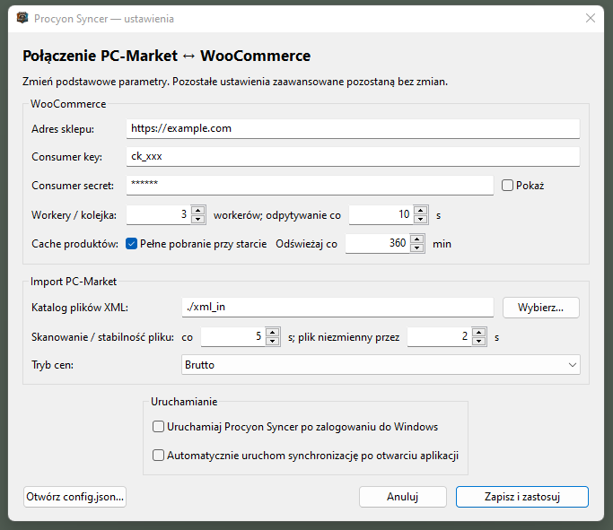

# Integracja PCM2WWW z WooCommerce


Ten plik opisuje integrację systemu **PC-Market 7 (PCM)** poprzez narzędzie **pcm2www** z platformą **WooCommerce**.
Integrator działa cyklicznie, pobiera dane z katalogu eksportów PC-Market (`exp_wyk_*.xml`) oraz synchronizuje je z WooCommerce przy użyciu REST API.

> **Status implementacji (2026-09-04):** funkcje oznaczone jako **[NIEGOTOWE]** nie są jeszcze ukończone.

## Funkcjonalności

- **Automatyczna synchronizacja** stanów magazynowych, cen i dostępności produktów dopasowanych po EAN (aktywna)
- **Obsługa cache** – pełne i przyrostowe odświeżanie danych z WooCommerce
- **Import plików PCM** – aktualnie obsługiwany format: `exp_wyk_*.xml` **[inne typy: NIEGOTOWE]**
- **Integracja przez REST API** WooCommerce: aktualizacja stanu, ceny i dostępności (aktywne); zmiana EAN i tworzenie nowych produktów są wyłączone
- **Elastyczna konfiguracja** poprzez natywne okno ustawień na Windows lub plik JSON
- **Ciągła praca w tle** – monitoring katalogu, kolejka tasków, worker wysyłki do Woo

---

Integrator posiada narzędzie CLI (Linux/Mac) oraz aplikację z systray (Windows).
Plik konfiguracyjny: `~/.config/pcm2www/config.json`

W wersji Windows pozycja **Ustawienia…** w menu ikony otwiera natywny formularz do konfiguracji WooCommerce, importu XML, cache i automatycznego startu integracji. Sekret Woo jest domyślnie zamaskowany, katalog eksportów można wybrać w systemowym oknie, a **Zapisz i zastosuj** waliduje dane przed przeładowaniem działającej synchronizacji. W sekcji **Uruchamianie** można niezależnie włączyć start programu po zalogowaniu do Windows oraz automatyczny start synchronizacji po otwarciu programu. Pola zaawansowane, których formularz nie pokazuje (m.in. baza danych, lista pól API i mapowania własnych pól), pozostają bez zmian; przycisk otwierający pełny `config.json` znajduje się wewnątrz okna ustawień. Pozycja **Otwórz logi** wyświetla natywne okno z czytelnym podglądem ostatnich wpisów, odświeżanym na żywo bez uruchamiania Notatnika.



---

## Struktura konfiguracji

```json
{
  "database": {
    "driver": "sqlite",
    "path": "~/.config/pcm2www/pcm2www.db",
    "dsn": ""
  },
  "integrations": {
    "woocommerce": {
      "base_url": "https://new...",
      "consumer_key": "ck_xxx",
      "consumer_secret": "GGoO .... .... .... ....",
      "poll_sec": 10,
      "cache": {
        "prime_on_start": true,
        "sweep_interval_minutes": 360,
        "fields": "id,sku,name,regular_price,sale_price,tax_class,stock_quantity,manage_stock,stock_status,backorders,catalog_visibility,status,global_unique_id,date_modified_gmt,type"
      },
      "custom_fields": [
        {
          "code": "hurt_price",
          "read_top_level": "hurt_price",
          "read_meta_key": "_hurt_price",
          "write_top_level": "hurt_price",
          "write_meta_key": "_hurt_price"
        }
      ]
    },
    "importer": {
      "watch_dir": "~/pcm2www/imports",
      "poll_sec": 5,
	  "price_mode": "gross",
	  "stability_seconds": 2
    }
  },
	"auto_start": false,
  "sync_interval_seconds": 10
}
```

Integracja składa się z trzech głównych sekcji:

- **database** – wybór silnika bazy danych (`sqlite` / `postgres` / `mysql`)
- **integrations.woocommerce** – ustawienia połączenia z WooCommerce
- **integrations.importer** – ustawienia importu plików z PC-Market

`integrations.importer.price_mode` określa, jaką cenę planner wysyła do WooCommerce:

- `"gross"` – domyślnie; wysyła ceny brutto z PC-Market bez przeliczania.
- `"net"` – przelicza ceny brutto z PC-Market na netto według `vat_id`.
- **auto_start, sync_interval_seconds** – parametry globalne

## Baza danych

Sekcja `database` pozwala przełączać backend danych:

- `driver: "sqlite"` – lokalny plik bazy (`path`), domyślny tryb.
- `driver: "postgres"` – połączenie po `dsn`.
- `driver: "mysql"` – połączenie po `dsn`.

Przykłady:

```json
{
  "database": {
    "driver": "postgres",
    "dsn": "host=127.0.0.1 user=pcm password=pcm dbname=pcm2www port=5432 sslmode=disable TimeZone=UTC"
  }
}
```

```json
{
  "database": {
    "driver": "mysql",
    "dsn": "pcm:pcm@tcp(127.0.0.1:3306)/pcm2www?parseTime=true&loc=UTC"
  }
}
```

> Zmiana `database.*` wymaga restartu aplikacji (reload configu nie przełącza aktywnego połączenia DB w locie).

## Parametry globalne

- **auto_start** – określa, czy po uruchomieniu procesu aplikacja ma od razu wystartować wszystkie integracje zapisane w `integrations`. `true` uruchamia importer, cache i workery bez klikania/komendy `start`; `false` uruchamia tylko CLI lub ikonę w trayu i czeka na ręczny start. Osobna opcja **Uruchamiaj Procyon Syncer po zalogowaniu do Windows** rejestruje aplikację w autostarcie bieżącego użytkownika Windows; nie jest zapisywana w tym pliku JSON.
- **sync_interval_seconds** – interwał wewnętrznego heartbeat syncera. Nie zastępuje `poll_sec` importera ani workera.

### Pierwsze uruchomienie

`LoadOrCreate()` tworzy kompletny szablon z integracjami `woocommerce` i `importer`, ale ustawia `auto_start=false`. Przed pierwszym ręcznym startem trzeba wpisać prawdziwy URL i klucze Woo oraz utworzyć lub wskazać istniejący `watch_dir`. Parser odrzuca nieznane pola JSON, a fabryki integracji odrzucają placeholdery, błędny URL, niedozwolony tryb ceny i niepoprawne interwały. Dopiero po udanym ręcznym starcie warto świadomie zmienić `auto_start` na `true`.

Przy uruchomieniu istniejący config ze starszej wersji jest automatycznie uzupełniany o brakującą sekcję `integrations.importer`, o ile zawiera integrację `woocommerce`. Dawne pole główne `watch_dir` zostaje użyte jako katalog importu; jeśli go nie ma, przyjmowane jest `~/pcm2www/imports`. Migracja zapisuje uzupełniony plik tylko raz i nie nadpisuje istniejących ustawień importera ani WooCommerce.

---

## Integracja WooCommerce

### Połączenie z API

- **base_url** – adres sklepu WooCommerce (REST API).
- **consumer_key** i **consumer_secret** – klucze API wygenerowane w WooCommerce.
- **poll_sec** – interwał pętli integracji WooCommerce (heartbeat), tutaj co **10 sekund**.

### Konfiguracja cache

Sekcja `cache` określa sposób buforowania danych produktów z WooCommerce:

- **prime_on_start** – przy starcie pobierany jest pełny stan produktów z Woo (paginowany, 100/stronę).
- **sweep_interval_minutes** – przyrostowe odświeżanie cache co **360 minut (6h)** – tylko produkty zmienione od ostatniego sweep (timestamp w tabeli `kvs`).
- **fields** – lista pól produktów pobieranych z WooCommerce:
  - id, sku – identyfikatory
  - name – nazwa produktu
  - regular_price, sale_price – ceny
  - tax_class – klasa podatkowa
  - stock_quantity, manage_stock – stany magazynowe
  - stock_status – `instock` / `outofstock` / `onbackorder`
  - backorders – `no` / `notify` / `yes`
  - catalog_visibility – widoczność w katalogu
  - status – status produktu (np. publish / draft)
  - global_unique_id – pole Woo "GTIN, UPC, EAN, lub ISBN"
  - date_modified_gmt – data ostatniej modyfikacji
  - type – typ produktu (np. simple, variable)

> `stock_status`, `backorders`, `tax_class` i `catalog_visibility` są zawsze dołączane do zapytań API niezależnie od wartości `fields` w konfiguracji.

Po poprawnym zakończeniu pełnego prime kandydat do usunięcia z cache jest jeszcze sprawdzany osobnym `GET /products/{id}`. Lokalny wpis jest usuwany wyłącznie po jednoznacznym HTTP 404; produkt pominięty wskutek przesunięcia paginacji zostaje zachowany. Czyszczenie nie jest wykonywane po niepełnym lub błędnym pobraniu. Sweep używa `status=any` i dwusekundowego nakładania zakresów czasowych, ale jako tryb przyrostowy sam nie wykrywa usunięć.

### Pola customowe

- **custom_fields** – lista mapowań dla customowych pól Woo/meta.
- Dla każdego pola można wskazać:
  - `read_top_level` – nazwę pola top-level zwracanego przez REST API
  - `read_meta_key` – klucz w `meta_data`
  - `write_top_level` – nazwę pola top-level używanego przy `PUT`
  - `write_meta_key` – klucz meta używany przy `PUT`
- Domyślny przykład: `hurt_price`, korzysta z meta `_hurt_price`.

### Worker wysyłki (kolejka `woo_tasks`)

Worker działa w tle i przetwarza kolejkę zadań atomicznie (claim → execute → verify → sync cache). Obsługiwane typy tasków:

| Kind | Opis | Polityki skip |
|---|---|---|
| `stock.update` | Aktualizacja stanu magazynowego | Skip jeśli `cena_detal=0` lub `do_usuniecia=Y`; skip jeśli `manage_stock=false`; skip jeśli stan już się zgadza; skip jeśli PCM nie zmienił stanu od poprzedniego importu |
| `price.update` | Aktualizacja ceny regularnej, hurtowej i klasy podatkowej (`tax_class`) | Skip jeśli `cena_detal=0` lub `do_usuniecia=Y`; skip jeśli aktywna `sale_price > 0`; skip jeśli cena i klasa podatkowa już się zgadzają |
| `availability.update` | Zarządzanie dostępnością produktu w sklepie | Skip jeśli stan w Woo już jest zgodny z oczekiwanym |

`price.update` używa `integrations.importer.price_mode`: domyślne `"gross"` wysyła ceny brutto z PC-Market, a `"net"` przelicza je na netto przed utworzeniem taska.

**Logika dostępności i flag PCM:**

| Warunek w PCM | Akcja w Woo |
|---|---|
| `do_usuniecia=N`, `cena_detal>0` | produkt aktywny: `manage_stock=true`, `backorders=notify`, `catalog_visibility=visible` |
| `do_usuniecia=Y` lub `cena_detal=0` | produkt niedostępny: `manage_stock=false`, `stock_status=outofstock`, `catalog_visibility=hidden`; bez aktualizacji ceny i stanu |

Flaga `do_usuniecia` nie usuwa produktu z WooCommerce. Powoduje tylko bezpieczne ukrycie istniejącego produktu dopasowanego po EAN.

`aktywny_w_SI` jest zapisywane w stagingu, ale obecnie nie steruje synchronizacją. W dostępnych eksportach wszystkie 941 wystąpień mają wartość `N`, również dla zwykłych produktów, więc potraktowanie `Y` jako warunku publikacji ukryłoby cały katalog. Flagę można włączyć do polityki dopiero po potwierdzeniu jej znaczenia i ustawień eksportu w PC-Market.

Przy przejściu ceny z `0` na wartość dodatnią task dostępności przywraca również bieżący stan z PCM. Zapobiega to pozostawieniu reaktywowanego produktu ze stanem `0` po wcześniejszym wyłączeniu `manage_stock`.

EAN jest wyłącznie kluczem dopasowania. Synchronizowane są tylko istniejące produkty Woo, których EAN jednoznacznie odpowiada `st_products.kod`. Brak zgodnego EAN oznacza brak linku i brak aktualizacji; aplikacja nie tworzy produktu ani nie wpisuje mu EAN. Stare zadania `ean.update` są kończone jako `skipped` bez wywołania API.

#### Ochrona przed nadpisaniem sprzedaży online

`st_stocks` przechowuje kolumnę `stan_prev` — poprzednią wartość stanu PCM przed ostatnim upsertem (NULL przy pierwszym imporcie produktu). Planner porównuje `stan` z `stan_prev`: jeśli są równe, PCM nie zmienił stanu od ostatniego eksportu, więc różnica w cache Woo prawdopodobnie wynika ze sprzedaży w sklepie — task `stock.update` nie jest generowany. Jeśli PCM zmienił stan (np. pracownik zrobił korektę lub przyjął dostawę), delta ≠ 0 i task jest generowany z wartością absolutną z PCM.

Bezpośrednio przed zapisem worker ponownie sprawdza, czy `woo_id` nadal jest jednoznacznie powiązane z tym samym `towar_id` i EAN. Nieaktualny task dostaje status `superseded` bez wywołania Woo. Każdy zapis jest weryfikowany przez osobny GET — również po zbiorczym POST. Błędy przejściowe (timeout, HTTP 429 i 5xx) są ponawiane z wykładniczym opóźnieniem, jitterem i uwzględnieniem `Retry-After`, maksymalnie do 5 prób. Wspólny circuit breaker wyhamowuje workery podczas awarii sklepu. Błąd zapisu stanu taska do bazy zatrzymuje integrację zamiast udawać powodzenie.
**Tworzenie nowych produktów w Woo jest [NIEGOTOWE].**

#### Stawki podatkowe

Podczas `price.update` ustawiana jest klasa podatkowa produktu na podstawie `vat_id` z PCM (`vatIDToTaxClass` w plannerze). Mapowanie:

| vat_id (PCM) | Klasa podatkowa w Woo (`tax_class`) |
|---|---|
| `2300` | `"2300"` (23%) |
| `800` | `"800"` (8%) |
| `500` | `"500"` (5%) |
| `0` | `"zero-rate"` (0%) |
| `-1` | `"zero-rate"` (ZW) |
| inny / brak | `""` (standard rate — fallback 23%) |

Pole `TaxClass` jest trzymane w `WooProductCache` i synchronizowane przez `syncCacheFromVerifiedProduct`.

---

## Importer (PCM → Woo)

Sekcja `importer` odpowiada za pobieranie danych z PC-Market:

- **watch_dir** – katalog, w którym PCM umieszcza eksporty. W tej konfiguracji: `~/pcm2www/imports`.
- **poll_sec** – co ile sekund sprawdzany jest katalog importu, tutaj co **5 sekund**.
- **stability_seconds** – minimalny czas, przez który rozmiar i data modyfikacji pliku muszą pozostać bez zmian przed importem (domyślnie **2 s**). Dodatkowa kontrola SHA256 wycofuje transakcję, jeśli plik zmieni się już podczas parsowania. Najpewniejszy sposób publikacji eksportu to zapis pod nazwą tymczasową i atomowa zmiana nazwy na `exp_wyk_*.xml` po zakończeniu zapisu.

Aktualnie parsowany format: `exp_wyk_*.xml`. Pliki ZIP nie są obsługiwane i importer je ignoruje. Inne typy eksportów PCM (`exp_dok_*` itp.) są **[NIEGOTOWE]**.

Deduplikacja pliku odbywa się przez SHA256 zawartości lub niepuste `transmisja_id`. Nazwa pliku jest tylko metadanym: PC-Market może użyć tej samej nazwy dla nowego eksportu i taki plik zostanie przetworzony, jeśli ma inną zawartość i transmisję. Nieudany import może zostać ponowiony z tym samym rekordem `import_files`.

Importer odrzuca powtórzony `towar_id` produktu i klucz stanu `(towar_id, magazyn_id)` wewnątrz jednego XML-a. `towar_id` jest stabilną tożsamością rekordu PCM; `kod`/EAN może się zmienić i wtedy aktualizuje ten sam rekord stagingu. Powiązanie ze sklepem nadal odbywa się wyłącznie po bieżącym EAN. Staging oraz oznaczenie importu jako `done` są zapisywane w jednej transakcji; błąd wycofuje wszystkie zmiany stagingu. Obsługiwane kodowania: ISO-8859-2, Windows-1250 i inne.

Linker wykrywa duplikaty EAN po obu stronach. Powtórzony EAN w PCM tworzy `link_issues.reason=duplicate_ean_source`, powtórzony EAN w Woo tworzy `duplicate_ean_shop`; niejednoznaczny produkt nie jest linkowany ani aktualizowany.

Migracje zapisują wersję w `schema_migrations`, mają minutowy deadline i są idempotentne. Przed zmianą istniejącej bazy SQLite powstaje kopia `pcm2www.db.backup-*` (zostaje pięć ostatnich). Migracja usuwa wyłącznie nadmiarowe duplikaty diagnostyk i starszych rekordów tego samego `towar_id`, zachowując najnowszy, oraz usuwa stare błędne indeksy.

Proces utrzymuje blokadę `pcm2www.lock`, dlatego druga lokalna instancja nie może jednocześnie przejąć tasków. Log `app.log` obraca się po 10 MiB i zachowuje pięć kopii.

## Lokalna walidacja sekwencji XML

Polecenie `./scripts/validate_xml_sequence.sh` kopiuje po kolei wszystkie `imports/incoming_test/exp_wyk_*.xml` do katalogu tymczasowego i importuje je do izolowanej bazy SQLite w pamięci. Nie otwiera ani nie zmienia bazy aplikacji. Po **każdym pojedynczym XML-u** niezależny model referencyjny porównuje pełny stan wszystkich pól `st_products`, `st_stocks` (w tym `stan_prev`) i tożsamość importu. Błąd wskazuje numer kroku, nazwę XML-a oraz produkt lub magazyn, na którym stan się rozszedł.

## Binarka z GitHub Actions

Każdy push i pull request buduje `ProcyonSyncer.exe`. Plik jest dostępny przez 30 dni w szczegółach uruchomienia workflow, w sekcji **Artifacts**.

Tag w formacie `vX.Y.Z` tworzy trwały GitHub Release i dołącza do niego gotową binarkę Windows. Przykład:

```bash
git tag v1.0.0
git push origin v1.0.0
```

Wersja z taga jest również zapisywana wewnątrz aplikacji. Ponowne uruchomienie workflow dla istniejącego taga podmienia binarkę w tym samym wydaniu.

---

## Przepływ danych

```
PC-Market 7
    └─ generuje exp_wyk_*.xml do watch_dir
           ↓ co poll_sec sekund
    [Importer] – SHA256 dedup, parsowanie XML, batch upsert
    ├─ st_products (staging produktów)
    └─ st_stocks (stany wg magazynów)
           ↓ po każdym imporcie
    [Linker] – dopasowanie EAN: st_products.kod ↔ woo_product_caches.ean
    └─ link_issues (diagnostyki: brak EAN, duplikaty, brak w sklepie)
           ↓
    [Planner] – porównanie staging vs cache, generowanie woo_tasks
    ├─ stock.update (jeśli stan się różni AND PCM zmienił stan od ostatniego importu)
    ├─ price.update (jeśli cena różni się i brak aktywnej promocji)
    └─ availability.update (zmiana dostępności; przy reaktywacji także stan PCM)
           ↓
    [Worker] – claim → fetch → verify → PUT → verify → sync cache
    └─ woo_product_caches (aktualizowany po weryfikacji)
           ↓
    WooCommerce REST API
```

Cache Woo odświeżany jest niezależnie:
- pełny paginowany odczyt i usunięcie nieistniejących wpisów cache przy starcie (`prime_on_start=true`),
- przyrostowe odświeżanie co `sweep_interval_minutes`.

---

## Podsumowanie statusu implementacji

| Funkcja | Status |
|---|---|
| Import `exp_wyk_*.xml` | Działa |
| Dedup plików (SHA256, transmisja_id) | Działa |
| Staging `st_products`, `st_stocks` | Działa |
| Cache WooCommerce (prime + sweep) | Działa |
| Linkowanie EAN (PCM ↔ Woo) | Działa |
| Planowanie tasków (planner) | Działa |
| Worker `stock.update` do Woo | Działa (batch 20) |
| Zmiana EAN w Woo | Wyłączona — EAN jest tylko kluczem linkowania |
| Worker `price.update` do Woo | Działa (batch 20) |
| Worker `availability.update` do Woo | Działa (batch 20) |
| Równoległe workery (`workers` w config) | Działa (domyślnie 3) |
| Synchronizacja klasy podatkowej (`tax_class`) | Działa |
| Tworzenie nowych produktów w Woo | NIEGOTOWE |
| Import innych typów eksportów PCM | NIEGOTOWE |
| Pobieranie zamówień z Woo | NIEGOTOWE |
